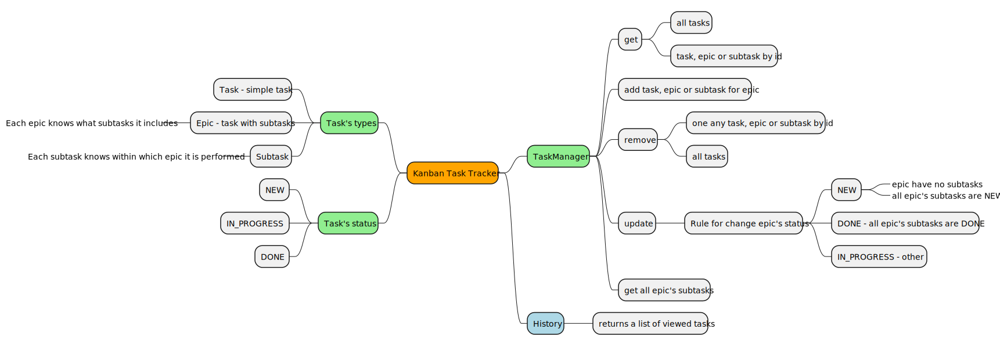
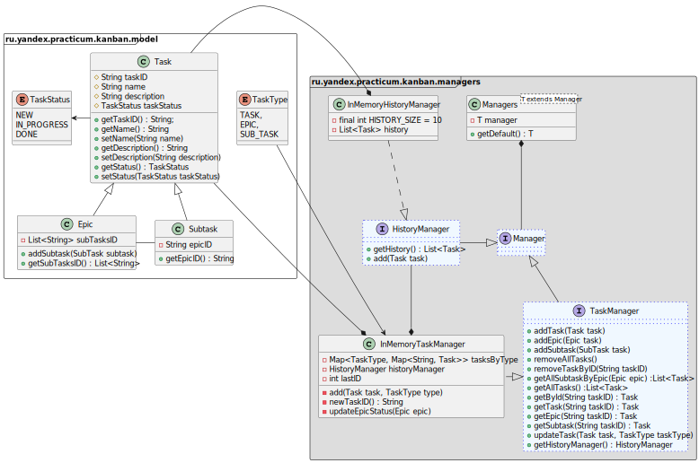

# Java Kanban

Сервис для организации совместной работы над задачами. Реализован на Java 11, без применения фреймворков.

## Оглавление
1. [Типы задач](README.md#Типы-задач)
2. [Менеджер](README.md#Менеджер)
3. [Истории просмотров задач](README.md#Истории-просмотров-задач)
4. [UML](README.md#uml)
5. [Диаграмма классов](README.md#Диаграмма-классов)

## Типы задач
Простейшим кирпичиком системы является задача (англ. task). У задачи есть следующие свойства:

    1. Название, кратко описывающее суть задачи (например, «Переезд»).
    2. Описание, в котором раскрываются детали.
    3. Уникальный идентификационный номер задачи, по которому её можно будет найти.
    4. Статус, отображающий её прогресс. Мы будем выделять следующие этапы жизни задачи:
        NEW — задача только создана, но к её выполнению ещё не приступили.
        IN_PROGRESS — над задачей ведётся работа.
        DONE — задача выполнена.

Иногда для выполнения какой-нибудь масштабной задачи её лучше разбить на подзадачи (англ. subtask).
Большую задачу, которая делится на подзадачи, мы будем называть эпиком (англ. epic).
Таким образом, в нашей системе задачи могут быть трёх типов: обычные задачи, эпики и подзадачи.
Для них должны выполняться следующие условия:

    Для каждой подзадачи известно, в рамках какого эпика она выполняется.
    Каждый эпик знает, какие подзадачи в него входят.
    Завершение всех подзадач эпика считается завершением эпика.

## **Менеджер**
Менеджер запускается на старте программы и управлять всеми задачами.
В нём реализованы следующие функции:

    1. Хранение задачь всех типов. 
    2. Методы для каждого из типа задач(Задача/Эпик/Подзадача):
        - Получение списка всех задач.
        - Удаление всех задач.
        - Получение по идентификатору.
        - Создание. 
        - Обновление. 
        - Удаление по идентификатору.
    3. Дополнительные методы:
        - Получение списка всех подзадач определённого эпика.
    4. Управление статусами осуществляется по следующему правилу:
        Менеджер сам не выбирает статус для задачи. Информация о нём приходит менеджеру вместе 
        с информацией о самой задаче. По этим данным в одних случаях он будет сохранять статус, 
        в других будет рассчитывать.
    5. Для эпиков: 
        если у эпика нет подзадач или все они имеют статус NEW, то статус должен быть NEW.
        если все подзадачи имеют статус DONE, то и эпик считается завершённым — со статусом DONE.
        во всех остальных случаях статус должен быть IN_PROGRESS.

## **Истории просмотров задач**
Пример формирования истории просмотров задач после вызовов методов менеджера:

## **UML**

## **Диаграмма классов**

